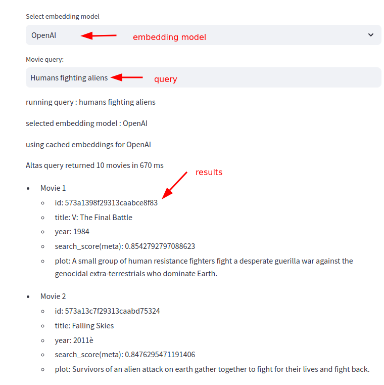

# Dockerizing the app

Here is the guide to dockerize the vector search app (using streamlit).

## Building the Docker App

`Dockerfile` has instructions

`requirements-docker.txt` is used to only have essential python modolues to reduce the size of docker image.  We also install `pytorch` for CPU only so not to pull in GPU libraries.

```bash
docker build .

# or to give it a name
docker build .  -t atlas-vector-search
```

You can check the docker image details as follows

```bash
docker  images | grep atlas
```

output may look like

```text
REPOSITORY              TAG             IMAGE ID       CREATED         SIZE
atlas-vector-search     latest          c02019648f3d   7 hours ago     2.79GB
```

## Running the Dockerized App

```bash
docker run  -p 8501:8501 atlas-vector-search
```

This will start the app.  You can access the UI here :   http://localhost:8501

Here is the screenshot fo the application




## Pushing the docker image into container repository

### Pushing to DockerHub

```bash
# authenticate it with Docker hub
docker login

## Tag the image with your dockerhub username
docker tag atlas-vector-search USERNAME/atlas-vector-search

# for example I would do  with my dockerhub username 'sujee'
docker tag atlas-vector-search  sujee/atlas-vector-search

# push
docker push USERNAME/atlas-vector-search
docker push sujee/atlas-vector-search
```

### Pushing to AWS Container Registry

TODO

### Pushing to Google Container Registry (GCR)

TODO

## Running Dockerized Application

```bash
docker run  -p 8501:8501 USERNAME/atlas-vector-search

docker run  -p 8501:8501 sujee/atlas-vector-search
```

If the docker image is not locally available, it will be downloaded

This will start the app.  You can access the UI here :   http://localhost:8501
