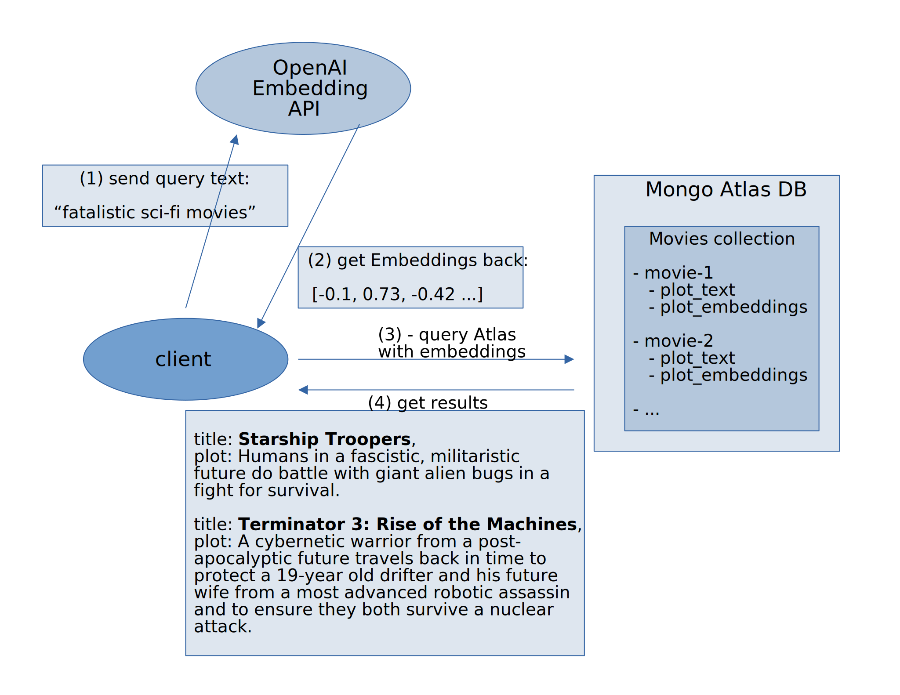

# Lab-2 - Vector Search Using OpenAI Embeddings

**In this lab, we will do the following:**

- ✅ The `embedded_movies` collection is already loaded into Atlas
- ✅ The collection already has an embedding attribute populated using OpenAI embeddings
- 👉 We will encode our query using OpenAI API call, and send the query to Atlas.  And get results back

## Data flow



## Lab 2.1 - Setup Atlas Index

[set up index on Atlas](setup-atlas-index.md)

## Lab 2.2 - Check OpenAI API Access

You will need an OpenAI API key.

You can get one [here](https://platform.openai.com/account/api-keys)

Run this notebook: [openai-test.ipynb](openai-test.ipynb) to verify your access key works.

## Lab 2.3 - Query Atlas DB

We have every thing we need to query Atlas!

[vector-search-openai.ipynb](vector-search-openai.ipynb)

## Lab 2.4 - Streamlit UI

Let's do a simple UI to display our movie results!

You can fireup Streamlit UI like this:

```bash
streamlit  run  vector-search-streamlit.py
```

This will open a browser UI at http://localhost:8501

